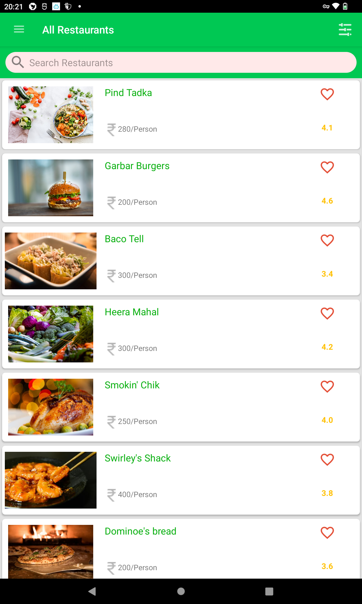
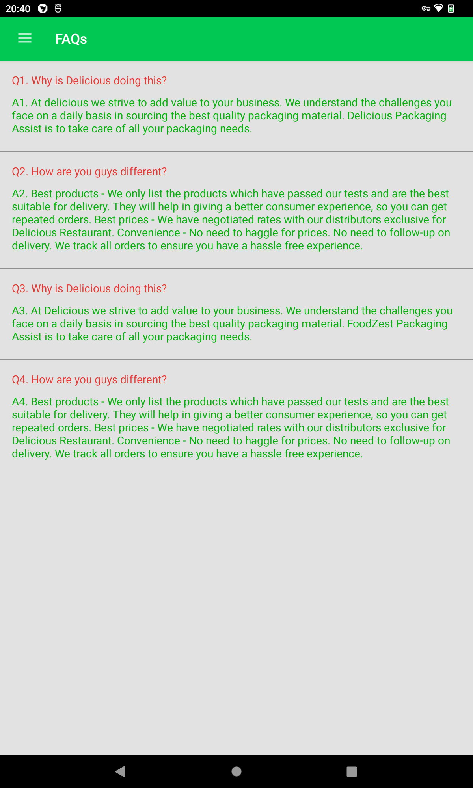
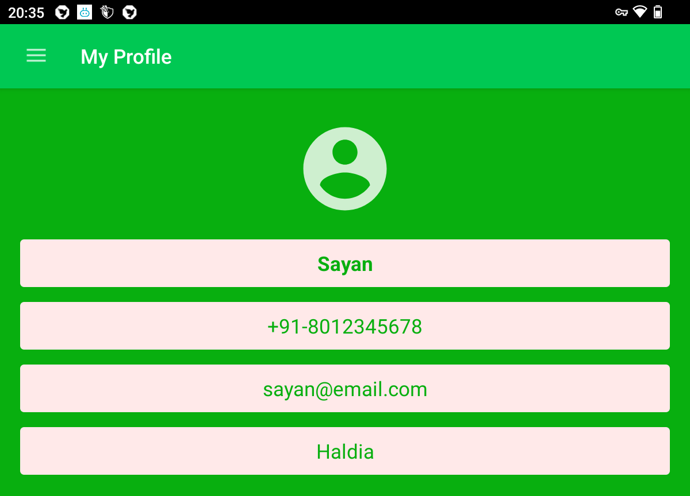
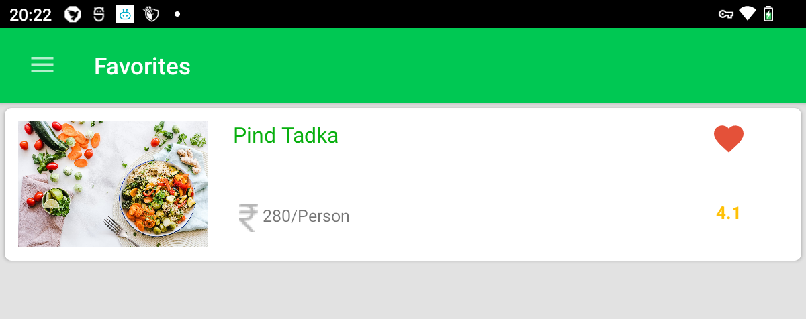

To clone this repository to your local system, run:

```bash
# HTTPS
git clone https://github.com/sayande717/prj-android-orderfood.git
```

##  Objectives
- This is the final app I made as part of my Internshala Training project.
- It is a food-ordering app that helps the user check what food is available at various restaurants, and place an order.
- Food items can be favourited and are then displayed in the favourites section.
- Login & logout has been implemented using Google FireBase.

## Tech Stack


## Screenshots

| Main Page ⬇️ | FAQ section ⬇️ |
|:---:|:---:|
|||
| **Profile** ⬇️| **Favourites** ⬇️|
||

